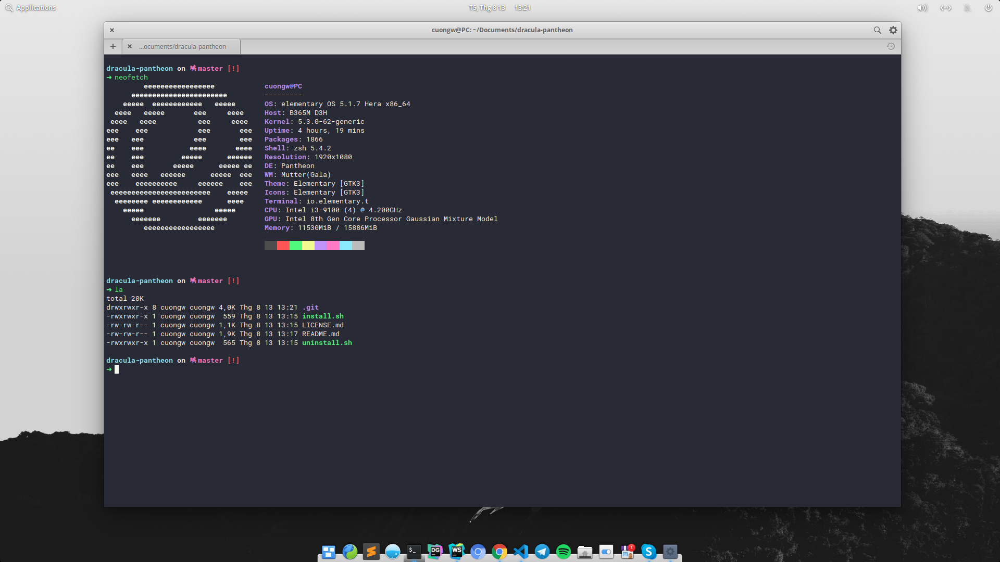

# dracula-pantheon

[](https://hitsofcode.com/view/github/harrytran103/dracula-pantheonn)
[](https://github.com/harrytran103/dracula-pantheon/blob/master/LICENSE)

> 🧛🏻‍♂️ Dark theme for Pantheon terminal.



## Install

```sh
sh -c "$(curl -sSL https://raw.githubusercontent.com/harrytran103/dracula-pantheon/master/install.sh)"
```

## Uninstall

```sh
sh -c "$(curl -sSL https://raw.githubusercontent.com/harrytran103/dracula-pantheon/master/uninstall.sh)"
```

## License

MIT


<!-- INSPIRATIONAL_QUOTE_START -->

<!-- INSPIRATIONAL_QUOTE_END -->
